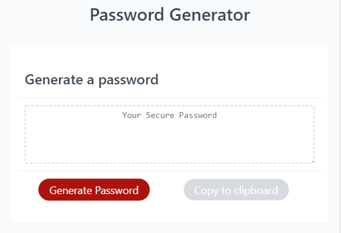

# Homework3
Password Generator 

# Unit 03 JavaScript Homework: Password Generator

## Description

This [application](https://sjmarsnc.github.io/PasswordGenerator/) generates a password based on responses from the user.   The user can specify: 

* Length (must be between 8 and 128 characters).  If the value given is not in this range a 
default length of 24 is used.  

* Character types to be used in the password:

  * Special characters ([see examples](https://www.owasp.org/index.php/Password_special_characters), all
  of these except the grave are used, as the grave is hard to distinguish from other types of quotes)

  * Numeric characters

  * Lowercase characters

  * Uppercase characters - this is generated from the lowercase string, to make it easier to modify 
  for languages with different characters than English.   

  If no character types are selected, the user is notified and all types are used.  

Once a password has been generated the user can click on the "Copy to Clipboard" button to copy the password
to the system clipboard so that they can paste it into the application that needs a password.   

In the case of a very small screen such as the iPhone 5 a media query removes the secondary title - don't really 
need the "Password Generator" and "Generate a password" and the "Generate Password" button!  

## User Story

AS AN employee with access to sensitive data

I WANT to randomly generate a password that meets certain criteria

SO THAT I can create a strong password that provides greater security

## Business Context

For companies that handle large amounts of sensitive data, weak passwords can pose a real security threat. An application that can generate strong passwords quickly and effortlessly saves employees time and ensures secure access to data.

## Acceptance Criteria

GIVEN that a user needs a new, secure password

WHEN prompted for password criteria

THEN a password is generated

 